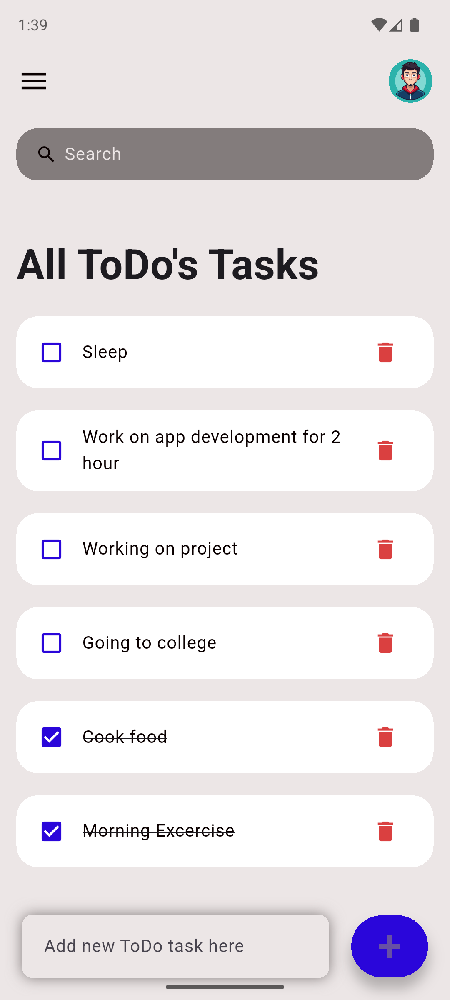
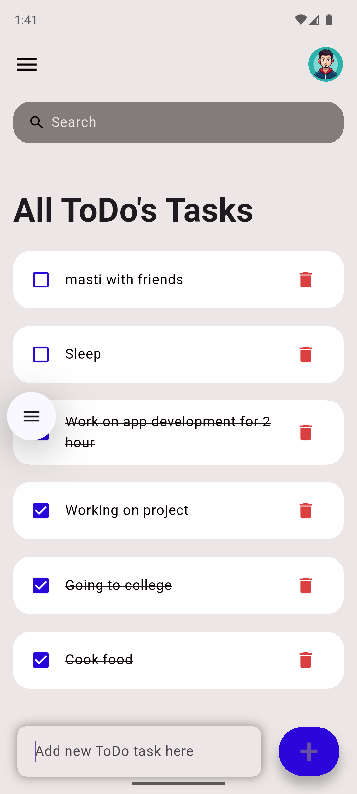
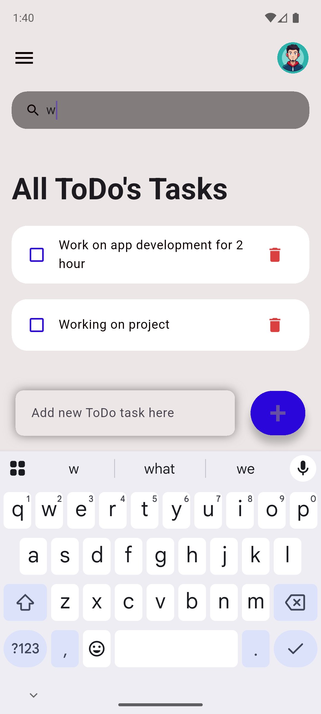
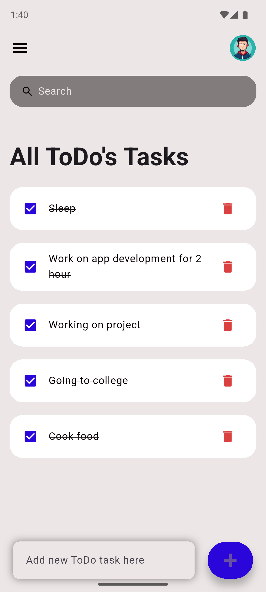

# 📝 Flutter To-Do List App

This is a simple yet functional **To-Do List app** built using **Flutter**.  
It allows users to:

- ✅ Add new tasks
- ❌ Delete tasks
- 🔍 Search through tasks
- ☑️ Mark tasks as done/undone

---

## 📱 Screenshots

| Home Screen | Adding Task | Search Feature |
|-------------|-------------|----------------|
|  |  |  |

| Mark as Done | Delete Task |
|--------------|-------------|
|  |  |


---

## 📌 Features

- ✨ Clean and minimal UI
- 🧾 Task List with add, delete, mark-as-done
- 🔍 Real-time search
- 🧠 All data managed in-memory (no backend or database used)

---

## 🚀 Getting Started

### ✅ Navigate to the project directory
```bash
cd flutter_todo_list
## ✅ Get Flutter dependencies

```bash
flutter pub get


